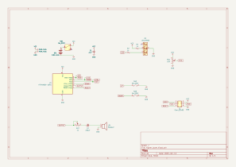
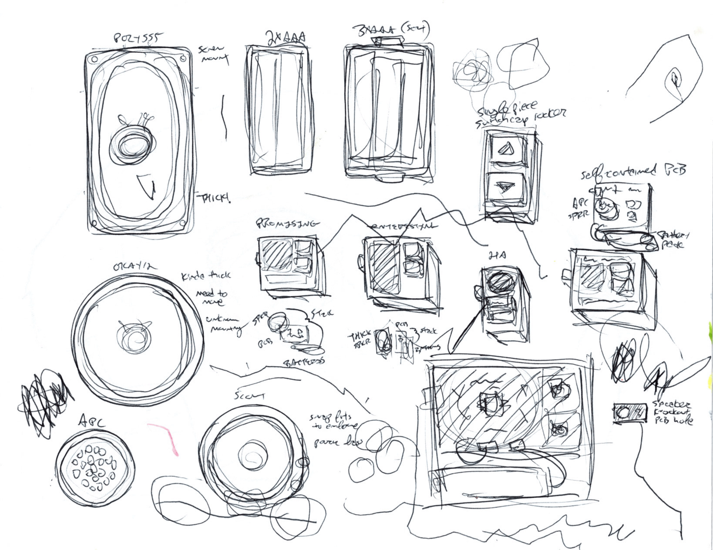

# Higher Lower

Higher Lower is a 3D-printed, screen-free, handheld electronic game about arbitrary musical intervals.

**DIY electronics kit:** [https://www.oskitone.com/product/higher-lower-game-diy-electronics-kit](https://www.oskitone.com/product/higher-lower-game-diy-electronics-kit)  
**Gameplay demo:** [https://vimeo.com/1075918437](https://vimeo.com/1075918437)  
**Assembly guide:** [https://oskitone.github.io/higher_lower](https://oskitone.github.io/higher_lower)

Obviously, I'd prefer you buy the kit from me. But, if circumstances prohibit, I've uploaded the [Higher Lower PCB to OSH Park](https://oshpark.com/shared_projects/yGNulCRo); please buy it from them with my blessing.

## How to play "Higher Lower"

Two different tones play. Is the second tone _higher_ or _lower_ than the first? The more guesses you get right, the harder it gets!

- Four guesses per round, ten rounds per game. Any wrong guess and the game resets.
- Your score is how many rounds have passed, and it's announced after each round as a series of happy trill noises.
- For a multiplayer game, hand off to the next player after each round. The last player to successfully complete their round wins.
- At the start of each new game, the "Higher Lower" theme song plays. It is a very good song.
- Upon completing all ten rounds of guesses and winning the game, the theme plays again, faster and _faster_ and **_faster_** until the machine finally resets into a new game at a harder difficulty setting.
- Adjust volume and game difficulty by opening the enclosure and adjusting trim potentiometers on the PCB.

## Schematic

In pursuit of a small BOM and quick assembly, there are a few concessions:

- There's no amplifier, just the IC to volume pot to cap to speaker. In theory, the speaker can draw more current than the chip can supply, causing it to overheat. In practice, it hasn't been an issue.
- There's a small .1uF bypass cap to smooth out power supply noise. Normally there's a big one too like the Scout's 220uF electrolytic cap. Again, in practice, its absence hasn't been an issue.

## Running, deploying

    ./run.sh -h

Requires arduino-cli to compile, [Ardens](https://github.com/tiberiusbrown/Ardens) to emulate, then a [Sparkfun programmer](https://www.sparkfun.com/products/9825) to upload. (Other programmers may work just as well, but I've only tested this one.)

### Deployment troubleshooting

- `Could not find USBtiny device`: Programmer not connected?
- `Programmer operation not supported`: Make sure board is getting full power. Try setting "CTRL" pot to its middle value. (Some pins to programmer are shared with game inputs.)

### Arduboy

You can also deploy to an [Arduboy](https://www.arduboy.com/) using the Arduino IDE. Play using the device's Up/Down buttons.

(And you can play an online emulation of "Higher Lower" on the Arduboy [here](https://tiberiusbrown.github.io/Ardens/player.html?file=https://github.com/oskitone/higher_lower/raw/main/misc/higher_lower.ino.hex)!)

## 3D Models

higher_lower's 3D-printed models are written in OpenSCAD.

### Dependencies

Assumes `parts_cafe` and `scout` repos are in sibling directories and are _both up to date_ on the `main` branch. Here's how I've got it:

    \ oskitone
        \ higher_lower
        \ parts_cafe
        \ scout

You'll also need to install the [Orbitron](https://fonts.google.com/specimen/Orbitron) font.

### Building

STLs are generated with `make_stls.sh`. Run `./make_stls.sh -h` for full flags list.

## License

Designed by Oskitone. Please support future projects by purchasing from [Oskitone](https://www.oskitone.com/).

Creative Commons Attribution/Share-Alike, all text above must be included in any redistribution. See license.txt for additional details.

(drawing by me and my son)
