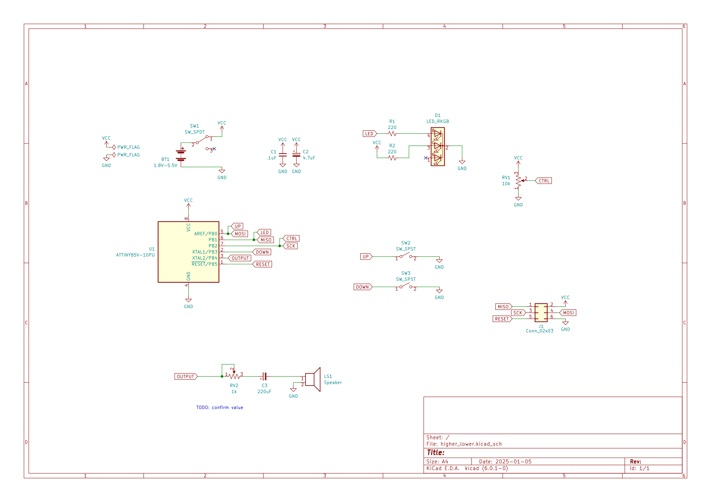

# Higher Lower

A handheld electronic game you can play with your eyes closed.

In development!

## TODO

- Reduce power usage
- Finalize circuit
- PCB + enclosure fit
- Minimum viable Arduboy setup
- Rainy day ideas (ie, probably not doing)
  - Countdown timer for each guess
  - Rocker design with fulcrum piece that wraps around switches
  - Proper random seeding
  - UART header

## Assembly Instructions

This is all tentative and will get replaced with the full documentation site treatment the other Oskitone kits have, but, for now, it's good enough!

### BOM

`TODO: confirm "Marking" values`

| Designator | Quantity | Designation        | Marking       | Package                                           |
| ---------- | -------- | ------------------ | ------------- | ------------------------------------------------- |
| SW2,SW3    | 2        | SW_SPST            |               | SW_PUSH_6mm                                       |
| C1         | 1        | .1uF               | 104           | C_Disc_D5.0mm_W2.5mm_P5.00mm                      |
| U1         | 1        | ATTINY85V + socket |               | DIP-8_W7.62mm                                     |
| D1         | 1        | LED_RKGB           |               | LED_D5.0mm-4_RGB_Staggered_Pins                   |
| RV2        | 1        | 1k                 | 103           | Potentiometer_Piher_PT-6-V_Vertical-mirror        |
| RV1        | 1        | 10k                | 104           | Potentiometer_Piher_PT-6-V_Vertical-mirror        |
| C3         | 1        | 220uF              |               | CP_Radial_D8.0mm_P3.50mm                          |
| C2         | 1        | 4.7uF              |               | CP_Radial_D5.0mm_P2.00mm                          |
| J1         | 1        | Conn_02x03         |               | PinHeader_2x03_P2.54mm_Vertical                   |
| SW1        | 1        | SW_SPDT            |               | SW_Slide_1P2T_CK_OS102011MS2Q                     |
| R2,R1      | 2        | 220                | Red Red Brown | R_Axial_DIN0207_L6.3mm_D2.5mm_P10.16mm_Horizontal |

Also:

- 2 2-wire ribbon cables (or similar _small_ gauge, stranded wire)
  - 1 3" for BT1 (TODO: confirm length)
  - 1 3" for LS1 (TODO: confirm length)
- 4 battery terminal contacts for battery holder
  - 1 dual spring+button wire contacts (Keystone 181)
  - 1 tabbed spring contact (Keystone 5204)
  - 1 tabbed button contact (Keystone 5226)

### PCB assembly

1. Build battery holder
   1. Place battery terminal contacts into battery holder 3D print. Bend and solder tabs to ribbon cable.
   2. TEST: Multimeter measures 2.4v to 3v at wires' ends.
2. Power board
   1. SW1, BT1, D1, R2
   2. TEST: Sliding SW1 powers the board, turning on/off D1's green color.
3. Add microcontroller
   1. R1, U1, C1, C2
   2. TEST: Sliding SW1 to power the board, D1's blue color flashes.
4. Make noise
   1. RV2, C3, LS1
   2. TEST: Sliding SW1 to power the board, a little tune plays out of the speaker and RV2 controls its volume. This is the "Higher Lower" theme song!
5. Add game inputs
   1. SW2, SW3
   2. TEST: With board powered, pressing either SW2 or SW3 plays more tones out of the speaker and flashes D1.
6. Control difficulty
   1. RV1
   2. TEST: Changing RV1's value _before powering the board_ changes the game's difficulty. Try different rotations and listen count the number of beeps before the theme song plays. More beeps = harder.
7. Optional: Hack
   1. J1
   2. TEST: See below for how to upload new code to the chip.

### Final assembly

1. Insert PCB into the enclosure bottom, nestled into its posts.
2. Pop speaker into place on enclosure top.
3. Insert battery holder into its hitch.
4. Place switch clutch onto SW1's actuator along left edge of PCB.
5. Rest button rocker on top of SW2 and SW3. It will wobble and that's fine; the enclosure top will hold it in place soon.
6. Snap enclosure top and bottom together.

### Schematic

## Running, deploying

    ./run.sh -h

Requires arduino-cli to compile, [Ardens](https://github.com/tiberiusbrown/Ardens) to emulate, then a [Sparkfun programmer](https://www.sparkfun.com/products/9825) to upload. (Other programmers may work just as well, but I've only tested this one.)

### Troubleshooting

- `Could not find USBtiny device`: Programmer not connected?
- `Programmer operation not supported`: Some pins to programmer are shared with game inputs. Try setting "CTRL" pot to its middle value.

## 3D Models

higher_lower's 3D-printed models are written in OpenSCAD.

### Dependencies

Assumes `parts_cafe` and `scout` repos are in sibling directories and are _both up to date_ on the `main` branch. Here's how I've got it:

    \ oskitone
        \ higher_lower
        \ parts_cafe
        \ scout

You'll also need to install the [Orbitron](https://fonts.google.com/specimen/Orbitron) font.

### Building

STLs are generated with `make_stls.sh`. Run `./make_stls.sh -h` for full flags list.

## License

Designed by Oskitone. Please support future synth projects by purchasing from [Oskitone](https://www.oskitone.com/).

Creative Commons Attribution/Share-Alike, all text above must be included in any redistribution. See license.txt for additional details.
